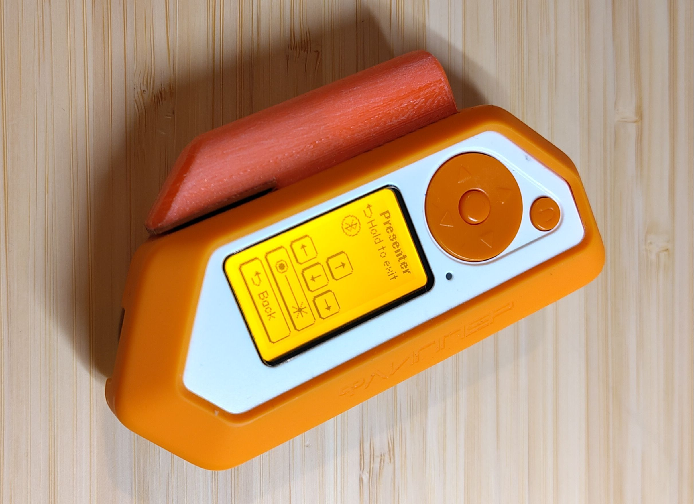

# HID App

This is a standalone version of the HID app Momentum. Thankfully, that project is GPL, so this one is as well.

## Functionality

### Keynote

Keynote - Remote for presentations

Keynote Vertical - Alternate remote for presentations

### Presenter

Presenter - Adds a laser module to the Keynote Vertical

### Keyboard

Keyboard - A functional keyboard, including modifier keys

### Numpad

Numpad - Number pad

### Media

Media - Media controls

### Apple Music macOS

Apple Music macOS - Alternate music controls

### Movie

Movie - Media controls for watching a movie

### Mouse

Mouse - Move the cursor and send clicks

### TikToc / YT Shorts

TikToc / YT Shorts - Specialized controls for short-form videos

### Mouse Clicker

Mouse Clicker - Repeatedly click the mouse after a delay

### Mouse Jiggler

Mouse Jiggler - Moves the mouse every few seconds

Mouse Jiggler Stealth - Moves the mouse a random direction and distance after a random time period

### Push To Talk

 

PushToTalk - Controls to unmute your microphone with various services
